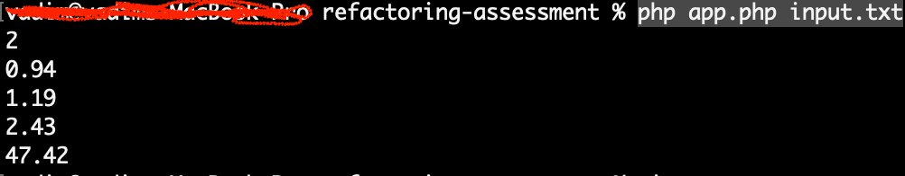

# PHP refactoring assessment
PHP refactoring skills assessment task

### Run
To run this app please set your API key in `.env` file (see `.env.example`)
Then open terminal and run this command:
```shell
php app.php input.txt
```
you will see some this like this:


### Unit tests
With unit tests covered two classes, `CurrencyService` and `CommissionCalculator`.
To setup everything and run unit tests please run the following in CLI:

```bash
composer install
```

after everything installed successfully run unit tests:

```bash
vendor/bin/phpunit tests/Services/CurrencyServiceTest.php
vendor/bin/phpunit tests/CommissionCalculator/CommissionCalculatorTest.php
```
